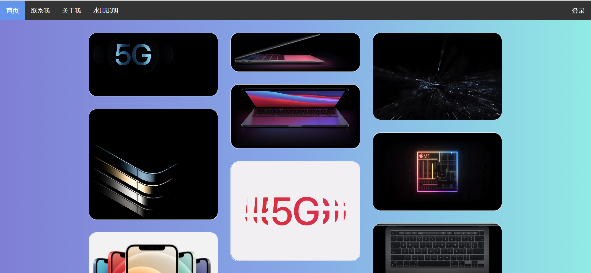
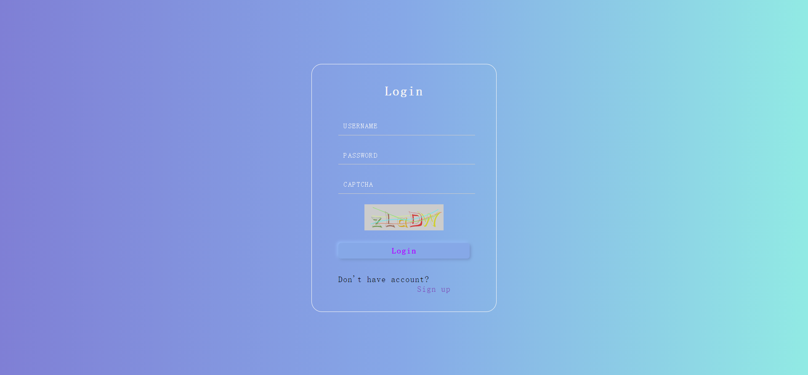
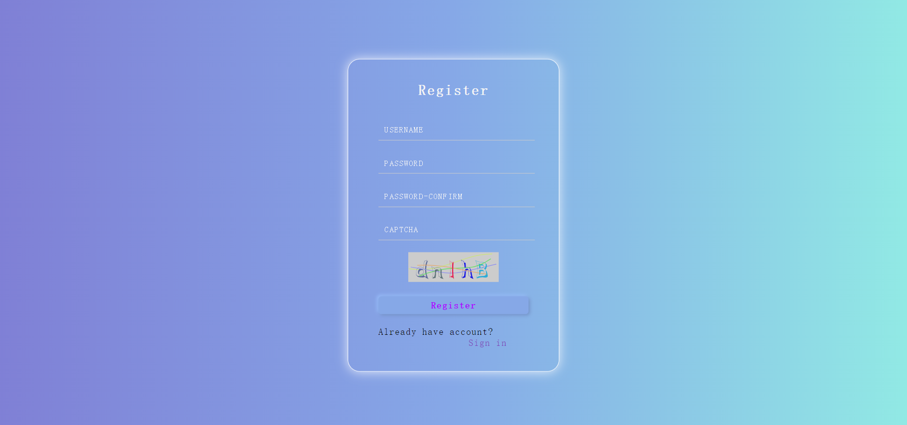

# express-html

*既然你已经打开了这个文档，可以求个star不？* 😃

## 实现功能简述

** 可以登陆、注册、注销，保持登陆状态（一分钟自动清除）** 实现了首页的展示，同时可以使用首页的顶栏对任何页面进行浏览。可以通过顶栏中的登录按钮进行登陆。进入登录页面后如果没有帐户即可直接跳转到注册页面。注册失败会有提示，注册成功则是直接跳转到登陆页面，登录成功后跳转到首页。其中用户名和密码带有正则表达式的校验，必须使用6-18位含有字母、数字、下划线（可选）组成的密码和5-20个以字母开头、可带数字、“_”、“.”的用户名。

## 启动方法

首先运行`web_userinfo.sql`，推荐使用MySQL5.7，如果使用MySQL8需要使用改变`root@localhost`的密码加密方式，改回MySQL5使用的mysql_native_password。

之后再文件夹中命令行运行

```bash
npm install
node bin/www
```

如果argon2出现问题请检查node-gyp。

访问localhost:3000即可。

已经预注册的账户有：

1. username: test , password:pwdtest1
2. username: icimence , password:icimence2020

## 界面展示








## 项目说明

### 框架

本项目使用express+html实现，使用的是express的ejs模板，通过修改引擎来实现对html文件的渲染。

### 文件结构

```bash
├─bin
├─build
├─public
│  ├─img
│  ├─javascripts
│  └─stylesheets
├─routes
└─views
```
bin中是启动脚本，build文件中是`node-gyp`自动生成的配置文件。public中则是网站的基本所有网页和需要的资源文件，routes中是请求的应答js，views中有index主页。

### 代码修改

#### app.js

修改了`app.js`，将原本使用的ejs模板转换为html，同时对api端口的请求进行指定，由`routes/api.js`进行应答

#### api.js

这个文件中包含了大部分的应答工作，首先使用MySQL对数据库进行连接，需要在这里将密码修改为本地的数据库密码，之后对缓存进行声明，定义其最大生命时长，之后开始写各个接口

captcha接口使用了svg-captcha模组实现了验证码的生成，使用session对captcha的答案进行存储，将svg图像传回前端。

login接口首先验证验证码的正确性，使用sql查询语句对用户数据进行查询，从MySQL中获取到对应的用户数据，时候使用argon2加密算法提供的verify函数对密码进行验证，如果匹配则用户登录成功。

register接口首先验证验证码的情况，通过sql查询语句对数据库进行查询，保证数据库中没有同名用户，使用argon2对密码进行加密之后存到数据库中。

status接口提供给所有的网页能够访问这个接口来获取已经登陆用户的状态，使用返回的用户名进行交互。

logout接口会直接销毁session来实现用户的注销。

#### user.js

这个js文件用来存储检测用户登陆状态以及注销功能，方便各个网站进行复用。使用jQuery和ajax向后端发送请求。

#### login/register/second/third.html

这些文件中添加了顶栏，可以进行直接的跳转，同时使用body的onload属性在页面加载时直接获取用户的登录状态。

其中的Register使用了